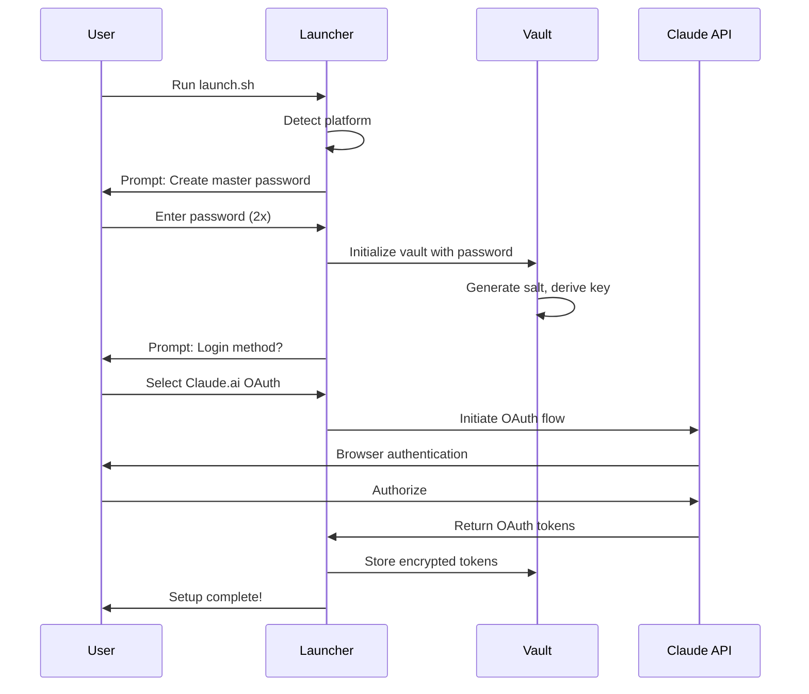
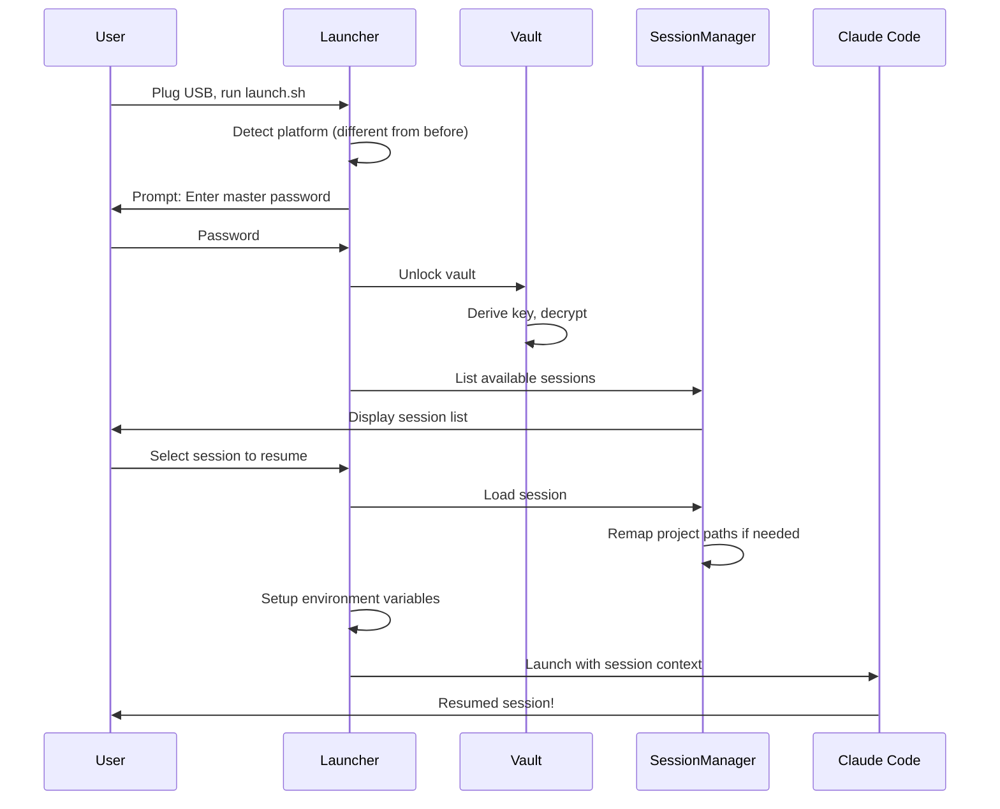
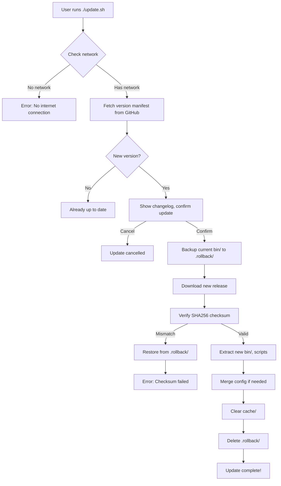
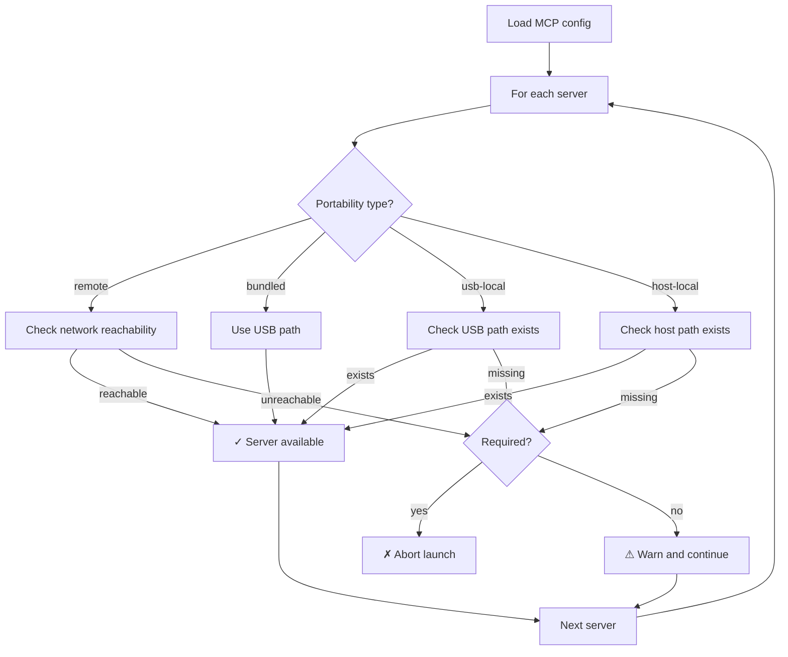

# Design Log #001: Claude Code Go - Portable Claude Environment

**Status**: ✅ Approved - Implementation Started
**Created**: 2026-01-17
**Author**: Claude (Design Phase)

---

## Background

**Claude Code Go** = Claude Code "on the go" - a portable version users can carry on a USB device to use their authenticated Claude environment on any guest computer.


Users want to carry their Claude Code environment on a USB device, enabling them to:
- Work from any machine without installing Claude Code system-wide
- Maintain authenticated sessions across different hosts
- Resume conversations and context from a portable device
- Keep their configuration, permissions, and preferences intact

This is particularly valuable for:
- Developers working across multiple workstations
- Consultants moving between client sites
- Users on shared/restricted machines where they cannot install software
- Privacy-conscious users who want no traces left on host machines

---

## Problem Statement

Claude Code currently stores:
- Credentials in OS-native secure storage (macOS Keychain, Windows Credential Manager)
- Sessions in `~/.claude/` directory
- Configuration in `~/.claude/settings.json` and `~/.claude.json`

This tightly couples Claude Code to a specific machine, making portability impossible without:
1. Re-authenticating on each new machine
2. Losing session history and context
3. Reconfiguring permissions and preferences

**Goal**: Create a self-contained portable Claude environment that securely stores credentials, sessions, and configuration on removable media.

---

## Installation & User Flows

### How Users Install Claude Code Go

**Option A: Download Release (Recommended for most users)**
```bash
# 1. Download the release zip from GitHub releases
# 2. Extract to USB drive

# macOS/Linux
curl -L https://github.com/.../claude-code-go/releases/latest/download/claude-code-go.zip \
  -o claude-code-go.zip
unzip claude-code-go.zip -d /Volumes/MyUSB/

# Windows: Download zip → Right-click → Extract to USB (E:\claude-code-go)
```

**Option B: Git Clone (For developers who want latest)**
```bash
cd /Volumes/MyUSB  # or E:\ on Windows
git clone https://github.com/.../claude-code-go.git
cd claude-code-go
./scripts/download-binaries.sh  # Fetches platform-specific binaries
```

### First-Time Setup (On User's Own Machine)

User plugs USB into their own machine and runs the launcher:

```
$ /Volumes/MyUSB/claude-code-go/launch.sh

╭─────────────────────────────────────────────╮
│       Claude Code Go - First Run            │
╰─────────────────────────────────────────────╯

Welcome! Let's set up your portable Claude environment.

Step 1: Create a master password to protect your credentials
        This password encrypts everything stored on this USB.

Master password (min 12 chars): ****************
Confirm password: ****************
✓ Vault created

Step 2: Link your Claude account

How would you like to authenticate?
  [1] Claude.ai account (Pro/Max subscription)
  [2] API Key (Claude Console)
  [3] Amazon Bedrock
  [4] Google Vertex AI

> 1

Opening browser for Claude.ai login...
✓ Authentication successful!
✓ Credentials encrypted and stored on USB

You're all set! Claude Code Go is ready to use.
```

### Using on a Guest/Different Computer

```
# User plugs USB into guest machine
$ /media/usb/claude-code-go/launch.sh

╭─────────────────────────────────────────────╮
│           Claude Code Go                    │
╰─────────────────────────────────────────────╯

Unlock your portable vault
Master password: ****************
✓ Vault unlocked

Previous sessions:
  [1] 2h ago  - myproject: "Implementing auth flow..."
  [2] 1d ago  - api-work: "Fixed pagination bug..."
  [3] Start new session

> 3

Enter project directory on this machine: /home/guest/projects/webapp
Starting new session...

╭─ Claude Code Go ─────────────────────────────╮
│ Portable Mode • Using account: you@email    │
╰──────────────────────────────────────────────╯
/home/guest/projects/webapp>
```

### Host Machine Has Different Claude Account - Complete Isolation

**Critical design requirement**: Claude Code Go operates in **complete isolation** from any Claude Code installed on the host machine.

```
┌────────────────────────────────────────────────────────────────┐
│                      HOST MACHINE                              │
│                                                                │
│  ┌──────────────────────────────────────────────────────────┐ │
│  │ Installed Claude Code (host user's)                      │ │
│  │ • Credentials: macOS Keychain (alice@company.com)        │ │
│  │ • Sessions: ~/.claude/                                   │ │
│  │ • Config: ~/.claude/settings.json                        │ │
│  └──────────────────────────────────────────────────────────┘ │
│                              ║                                 │
│                     NO INTERACTION                             │
│                     (complete isolation)                       │
│                              ║                                 │
│  ┌──────────────────────────────────────────────────────────┐ │
│  │ USB: Claude Code Go (portable user's)                    │ │
│  │ • Credentials: USB/vault/credentials.vault (encrypted)   │ │
│  │   → bob@personal.com (different account!)                │ │
│  │ • Sessions: USB/sessions/                                │ │
│  │ • Config: USB/config/settings.json                       │ │
│  │ • Runtime: USB/bin/{platform}/node (bundled)             │ │
│  └──────────────────────────────────────────────────────────┘ │
└────────────────────────────────────────────────────────────────┘
```

**How isolation is achieved:**

| Resource | Host Claude Code | Claude Code Go |
|----------|------------------|----------------|
| Credentials | System keychain | USB encrypted vault |
| Sessions | `~/.claude/` | `USB/sessions/` |
| Config | `~/.claude/settings.json` | `USB/config/` |
| Node.js runtime | System PATH | Bundled on USB |
| API calls | Host's account | Portable account |
| Temp files | System temp | Isolated (cleaned up) |

The launcher achieves this by overriding all paths via environment variables:
```bash
export CLAUDE_CONFIG_DIR="$USB_ROOT/config"
export CLAUDE_DATA_DIR="$USB_ROOT/sessions"
export CLAUDE_CACHE_DIR="$USB_ROOT/cache"
export CLAUDE_CREDENTIAL_PROVIDER="portable-vault"
export CLAUDE_VAULT_PATH="$USB_ROOT/vault/credentials.vault"
export PATH="$USB_ROOT/bin/$PLATFORM/node/bin:$PATH"
# These override ALL default paths - host Claude Code is never touched
```

### On Exit - Clean Disconnect

```
/home/guest/projects/webapp> /exit

Saving session to USB...
✓ Session saved
✓ Vault locked
✓ Temp files cleaned

Safe to remove USB device.
```

---

## Questions and Answers

### Q1: What platforms must be supported?
**A**: Windows, macOS, and Linux. The portable environment should work when the USB is plugged into any of these platforms.

### Q2: How should credentials be protected on the USB device?
**A**: Use AES-256 encryption with a master password. Credentials should never be stored in plaintext. Consider hardware-encrypted USB drives as an additional recommendation.

### Q3: What happens if the USB is lost or stolen?
**A**: Encrypted container + master password provides protection. Users should be able to revoke sessions remotely via Claude.ai account settings. Design should include guidance on using hardware-encrypted USBs.

### Q4: Should this support OAuth tokens or only API keys?
**A**: Both. OAuth tokens are more complex (refresh flows) but better for individual users. API keys are simpler and better for enterprise/team scenarios.

### Q5: How do we handle platform-specific binaries?
**A**: Bundle binaries for all three platforms on the USB. Use a launcher script that detects the current OS and runs the appropriate binary.

### Q6: What about Node.js runtime dependency?
**A**: Bundle a portable Node.js runtime for each platform. This ensures no dependencies on the host machine.

### Q7: How do we handle session resumption when the USB was used on a different machine previously?
**A**: Sessions are stored entirely on the USB. The session contains conversation history, context, and project paths. Project paths may need remapping if the host machine's filesystem differs.

### Q8: Should we leave any traces on the host machine?
**A**: Minimal traces by default. Temp files should be cleaned up on session end. Offer a "paranoid mode" that uses encrypted ramdisk for all temp operations.

---

## Design

### Architecture Overview

```
USB Device (claude-go/)
├── bin/
│   ├── darwin-arm64/
│   │   ├── claude-go          # Native Go binary
│   │   └── node/              # Portable Node.js runtime
│   ├── darwin-x64/
│   │   ├── claude-go
│   │   └── node/
│   ├── linux-x64/
│   │   ├── claude-go
│   │   └── node/
│   └── windows-x64/
│       ├── claude-go.exe
│       └── node/
├── vault/                      # Encrypted credential store
│   └── credentials.vault       # AES-256 encrypted
├── sessions/                   # Session storage
│   ├── session-abc123.json
│   └── session-def456.json
├── config/
│   ├── settings.json          # User preferences
│   ├── permissions.json       # Permission rules
│   └── mcp-servers.json       # MCP configuration
├── cache/                     # Optional caching
│   └── ...
├── launch.sh                  # macOS/Linux launcher
├── launch.bat                 # Windows launcher
└── README.md                  # User instructions
```

### Component Design

#### 1. Launcher (Go Binary)

```go
// Platform detection and environment setup
type Launcher struct {
    USBRoot    string       // Path to USB mount point
    Platform   Platform     // darwin-arm64, linux-x64, etc.
    VaultPath  string       // Path to encrypted vault
    ConfigPath string       // Path to config directory
}

type Platform string
const (
    DarwinARM64   Platform = "darwin-arm64"
    DarwinX64     Platform = "darwin-x64"
    LinuxX64      Platform = "linux-x64"
    WindowsX64    Platform = "windows-x64"
)

func (l *Launcher) DetectPlatform() Platform
func (l *Launcher) SetupEnvironment() error
func (l *Launcher) LaunchClaude(args []string) error
```

#### 2. Credential Vault

```go
// Encrypted credential storage
type Vault struct {
    Path       string
    cipher     cipher.AEAD  // AES-256-GCM
    key        []byte       // Derived from master password
}

type VaultEntry struct {
    Type       CredentialType  // oauth, apikey, bedrock, vertex
    Provider   string          // claudeai, console, aws, gcp
    Encrypted  []byte          // Encrypted credential data
    ExpiresAt  *time.Time      // For OAuth tokens
    Metadata   map[string]string
}

type CredentialType string
const (
    OAuth   CredentialType = "oauth"
    APIKey  CredentialType = "apikey"
    AWS     CredentialType = "aws"
    GCP     CredentialType = "gcp"
)

// Key derivation from master password
func DeriveKey(password string, salt []byte) ([]byte, error) {
    // Use Argon2id for key derivation
    return argon2.IDKey(
        []byte(password),
        salt,
        3,              // iterations
        64*1024,        // memory (64MB)
        4,              // parallelism
        32,             // key length (256 bits)
    ), nil
}
```

#### 3. Session Manager

```go
type PortableSession struct {
    ID          string
    CreatedAt   time.Time
    LastUsedAt  time.Time
    HostMachine string          // Original host identifier
    Project     ProjectRef      // Project reference
    History     []Message       // Conversation history
    Context     SessionContext  // Summarized context
    Permissions []Permission    // Granted permissions
}

type ProjectRef struct {
    OriginalPath string         // /Users/alice/projects/myapp
    RelativePath string         // projects/myapp (portable)
    RemappedPath string         // Current host path (computed)
}

type SessionManager struct {
    SessionsDir string
}

func (sm *SessionManager) ListSessions() ([]PortableSession, error)
func (sm *SessionManager) LoadSession(id string) (*PortableSession, error)
func (sm *SessionManager) SaveSession(s *PortableSession) error
func (sm *SessionManager) RemapProjectPath(s *PortableSession, hostPath string) error
```

#### 4. Environment Isolation

```go
type Environment struct {
    // All paths point to USB device
    CLAUDE_HOME      string  // USB/config
    CLAUDE_SESSIONS  string  // USB/sessions
    CLAUDE_CACHE     string  // USB/cache

    // Credential provider override
    CLAUDE_CREDENTIAL_PROVIDER string  // "portable-vault"
    CLAUDE_VAULT_PATH          string  // USB/vault/credentials.vault

    // Temp directory handling
    TMPDIR           string  // Host temp or encrypted ramdisk
}

func (e *Environment) Export() map[string]string
func (e *Environment) ToEnvFile() string
```

### Security Design

#### Encryption at Rest

```
┌─────────────────────────────────────────────────────┐
│                  Vault File Format                   │
├─────────────────────────────────────────────────────┤
│  Magic Number (4 bytes): "CGOV"                     │
│  Version (2 bytes): 0x0001                          │
│  Salt (32 bytes): Random                            │
│  Nonce (12 bytes): Random per entry                 │
│  Encrypted Data (variable): AES-256-GCM             │
│  Auth Tag (16 bytes): GCM authentication            │
└─────────────────────────────────────────────────────┘
```

#### Threat Model

| Threat | Mitigation |
|--------|------------|
| USB theft | AES-256 encryption, strong master password |
| Brute force | Argon2id key derivation (memory-hard) |
| Memory dumps | Zero credentials after use, avoid swapping |
| Host compromise | Minimal trust in host, no credential caching |
| Shoulder surfing | Password input masking |
| Token replay | OAuth refresh handling, session binding |

#### Security Recommendations for Users

1. **Hardware-encrypted USB**: Recommend devices with hardware encryption (IronKey, Apricorn)
2. **Strong master password**: Minimum 16 characters, enforced complexity
3. **Remote revocation**: Document how to revoke access via Claude.ai
4. **Timeout locking**: Auto-lock vault after inactivity period

### User Flows

#### First-Time Setup



#### Resume on New Machine



### CLI Interface

```bash
# First-time setup
$ ./launch.sh
claude-go: Portable Claude Environment
No vault found. Let's set up your portable environment.

Create a master password (min 16 chars): ****************
Confirm password: ****************

How would you like to authenticate?
1. Claude.ai account (OAuth)
2. API Key (Claude Console)
3. Amazon Bedrock
4. Google Vertex AI

> 1

Opening browser for authentication...
Authentication successful! Credentials stored securely.

# Normal launch
$ ./launch.sh
claude-go: Unlocking vault...
Master password: ****************

Available sessions:
1. [2h ago] myproject - "Implementing user auth..."
2. [1d ago] api-server - "Fixing pagination bug..."
3. Start new session

> 1

Resuming session... Project path remapped: /home/alice/myproject -> /Users/bob/myproject
```

### Configuration Schema

```typescript
// config/settings.json
interface PortableSettings {
  version: "1.0";

  // Vault settings
  vault: {
    autoLockMinutes: number;      // Auto-lock after inactivity (default: 15)
    requirePasswordOnResume: boolean;  // Require password each session
  };

  // Session settings
  sessions: {
    cleanupPeriodDays: number;    // Delete old sessions (default: 30)
    maxSessions: number;          // Maximum stored sessions (default: 100)
  };

  // Environment settings
  environment: {
    paranoidMode: boolean;        // Use ramdisk for temp files
    cleanupOnExit: boolean;       // Remove temp files on exit
    defaultModel: string;         // Preferred model
  };

  // Path remapping rules
  pathRemapping: {
    rules: PathRemapRule[];
  };
}

interface PathRemapRule {
  pattern: string;    // Glob pattern to match
  replacement: string; // Replacement template
  platforms?: Platform[];  // Apply only to these platforms
}
```

---

## Implementation Plan

### Phase 1: Core Infrastructure
1. **Project setup**: Initialize Go module, directory structure
2. **Platform detection**: Implement OS/arch detection
3. **Vault implementation**: AES-256-GCM encryption, Argon2id key derivation
4. **Basic launcher**: Platform-specific binary selection and execution

### Phase 2: Authentication
1. **OAuth flow**: Browser-based authentication for Claude.ai
2. **API key storage**: Secure storage for console API keys
3. **Token refresh**: Handle OAuth token expiration
4. **Credential provider interface**: Allow multiple auth backends

### Phase 3: Session Management
1. **Session storage**: Save/load session state to USB
2. **Path remapping**: Handle different host machine paths
3. **Session picker**: Interactive session selection
4. **Session cleanup**: Automatic old session removal

### Phase 4: Claude Code Integration
1. **Environment injection**: Set up Claude Code to use portable paths
2. **Launch wrapper**: Start Claude Code with correct configuration
3. **Credential bridge**: Provide credentials to Claude Code
4. **Session sync**: Keep portable sessions in sync with Claude Code

### Phase 5: Polish & Security
1. **Auto-lock**: Implement vault timeout
2. **Paranoid mode**: Encrypted ramdisk for temp files
3. **Cleanup utilities**: Remove traces from host machine
4. **Documentation**: User guide, security recommendations

---

## Examples

### ✅ Good: Encrypted vault initialization

```go
func InitializeVault(password string) (*Vault, error) {
    salt := make([]byte, 32)
    if _, err := rand.Read(salt); err != nil {
        return nil, fmt.Errorf("failed to generate salt: %w", err)
    }

    key := argon2.IDKey([]byte(password), salt, 3, 64*1024, 4, 32)

    block, err := aes.NewCipher(key)
    if err != nil {
        return nil, fmt.Errorf("failed to create cipher: %w", err)
    }

    gcm, err := cipher.NewGCM(block)
    if err != nil {
        return nil, fmt.Errorf("failed to create GCM: %w", err)
    }

    return &Vault{cipher: gcm, key: key}, nil
}
```

### ❌ Bad: Plaintext credential storage

```go
// NEVER DO THIS
func SaveCredentials(path string, token string) error {
    return os.WriteFile(path, []byte(token), 0600)  // Plaintext!
}
```

### ✅ Good: Path remapping with validation

```go
func (sm *SessionManager) RemapProjectPath(session *PortableSession, hostRoot string) error {
    // Validate host path exists
    if _, err := os.Stat(hostRoot); os.IsNotExist(err) {
        return fmt.Errorf("host project path does not exist: %s", hostRoot)
    }

    session.Project.RemappedPath = hostRoot
    session.Project.HostMachine = getHostIdentifier()

    return sm.SaveSession(session)
}
```

### ❌ Bad: Assuming paths work across machines

```go
// NEVER DO THIS
func LoadSession(session *Session) {
    // Assumes original path exists on current machine
    os.Chdir(session.Project.OriginalPath)  // Will fail!
}
```

---

## Trade-offs

| Decision | Pros | Cons |
|----------|------|------|
| **Go for launcher** | Single binary, cross-platform, fast startup | Another language in the ecosystem |
| **Bundled Node.js** | No host dependencies | Large USB footprint (~200MB) |
| **Master password** | Simple UX, industry standard | Single point of failure |
| **Argon2id** | Memory-hard, modern, secure | Slower unlock (~1s) |
| **Session-on-USB** | Full portability | Sessions can grow large |
| **Path remapping** | Works across machines | Requires user input sometimes |

### Alternative Considered: Hardware Key (FIDO2/WebAuthn)

**Pros**: No password to remember, phishing-resistant
**Cons**: Requires additional hardware, complex implementation
**Decision**: Defer to future version; master password is MVP

### Alternative Considered: Cloud Sync for Sessions

**Pros**: Sessions available without USB, backup
**Cons**: Defeats privacy goal, requires internet
**Decision**: Out of scope; users who want sync can use Claude.ai directly

---

## Edge Cases & Scenarios

### Scenario: User runs both host Claude Code and Claude Code Go simultaneously

**Behavior**: Both work independently. No conflicts.
- Host Claude Code uses system credentials and `~/.claude/`
- Claude Code Go uses USB vault and `USB/sessions/`
- API calls go to different accounts (if different users)
- No shared state whatsoever

### Scenario: USB removed while session is active

**Behavior**: Session may lose recent unsaved state.
- Auto-save happens periodically (configurable, default every 30s)
- On next launch, session recovers to last checkpoint
- Warning: Always use `/exit` or Ctrl+C for clean shutdown

### Scenario: Master password forgotten

**Behavior**: Credentials are unrecoverable (by design).
- Vault is encrypted with password-derived key
- No recovery mechanism (security feature)
- User must re-authenticate and create new vault
- Previous sessions are lost

### Scenario: OAuth token expires while on guest machine

**Behavior**: Refresh token used automatically.
- OAuth tokens stored with refresh tokens
- Claude Code Go refreshes transparently
- If refresh fails, user prompted to re-authenticate
- Browser opens on guest machine for login

### Scenario: Guest machine has no browser

**Behavior**: Fall back to device code flow.
- Display code + URL for user to visit on phone
- Similar to how TV apps authenticate
- Or use API key method which requires no browser

---

## Update Mechanism

### Design: Self-Contained Update with Data Preservation

The USB contains an `update.sh` (and `update.bat`) script that:
1. Checks for newer versions
2. Downloads only the binary/runtime components
3. Preserves all user data (vault, sessions, config)
4. Verifies integrity via checksums
5. Supports rollback if update fails

### Directory Structure (Update-Aware)

```
USB/claude-code-go/
├── bin/                    # ← UPDATED (platform binaries + Node.js)
│   ├── darwin-arm64/
│   ├── darwin-x64/
│   ├── linux-x64/
│   └── windows-x64/
├── vault/                  # ← PRESERVED (never touched by updates)
│   └── credentials.vault
├── sessions/               # ← PRESERVED
├── config/                 # ← PRESERVED (merged if new defaults added)
│   └── settings.json
├── cache/                  # ← CLEARED (safe to regenerate)
├── .version                # Current version metadata
├── .rollback/              # Previous version backup (created during update)
├── update.sh               # ← UPDATED
├── update.bat              # ← UPDATED
├── launch.sh               # ← UPDATED
└── launch.bat              # ← UPDATED
```

### Update Flow



### User Experience

```bash
$ ./update.sh

Claude Code Go - Update Check
Current version: 1.2.0

Checking for updates...
✓ New version available: 1.3.0

Changes in 1.3.0:
  • Added support for Claude 4 models
  • Fixed OAuth token refresh on Linux
  • Improved session resumption speed

Download size: 45 MB

Proceed with update? [Y/n] y

Backing up current version...
Downloading claude-code-go-1.3.0.zip...
████████████████████████████████ 100%

Verifying checksum...
✓ Checksum valid

Installing update...
✓ Binaries updated
✓ Scripts updated
✓ Config merged (1 new setting added)
✓ Cache cleared

Update complete! You're now on version 1.3.0.
Your credentials, sessions, and settings were preserved.
```

### Implementation

```go
// update/updater.go

type Updater struct {
    USBRoot        string
    CurrentVersion string
    ManifestURL    string  // https://github.com/.../releases/latest/manifest.json
}

type VersionManifest struct {
    Version     string            `json:"version"`
    ReleaseDate string            `json:"release_date"`
    Changelog   []string          `json:"changelog"`
    Downloads   map[string]Download `json:"downloads"`  // platform -> download info
    MinVersion  string            `json:"min_version"` // minimum upgradeable version
}

type Download struct {
    URL      string `json:"url"`
    SHA256   string `json:"sha256"`
    Size     int64  `json:"size"`
}

func (u *Updater) CheckForUpdate() (*VersionManifest, error) {
    resp, err := http.Get(u.ManifestURL)
    if err != nil {
        return nil, fmt.Errorf("failed to check for updates: %w", err)
    }
    defer resp.Body.Close()

    var manifest VersionManifest
    if err := json.NewDecoder(resp.Body).Decode(&manifest); err != nil {
        return nil, fmt.Errorf("invalid manifest: %w", err)
    }

    if semver.Compare(manifest.Version, u.CurrentVersion) <= 0 {
        return nil, nil // Already up to date
    }

    return &manifest, nil
}

func (u *Updater) PerformUpdate(manifest *VersionManifest) error {
    // 1. Create rollback backup
    if err := u.createRollback(); err != nil {
        return fmt.Errorf("backup failed: %w", err)
    }

    // 2. Download new version
    platform := detectPlatform()
    download := manifest.Downloads[platform]

    tmpFile, err := u.downloadWithProgress(download.URL, download.Size)
    if err != nil {
        u.rollback()
        return fmt.Errorf("download failed: %w", err)
    }

    // 3. Verify checksum
    if !u.verifyChecksum(tmpFile, download.SHA256) {
        u.rollback()
        return fmt.Errorf("checksum verification failed")
    }

    // 4. Extract and install
    if err := u.extractUpdate(tmpFile); err != nil {
        u.rollback()
        return fmt.Errorf("extraction failed: %w", err)
    }

    // 5. Merge config (add new defaults, preserve user values)
    if err := u.mergeConfig(); err != nil {
        // Non-fatal, just warn
        log.Printf("Warning: config merge issue: %v", err)
    }

    // 6. Cleanup
    os.RemoveAll(filepath.Join(u.USBRoot, ".rollback"))
    os.RemoveAll(filepath.Join(u.USBRoot, "cache"))

    return nil
}

func (u *Updater) rollback() error {
    rollbackDir := filepath.Join(u.USBRoot, ".rollback")
    binDir := filepath.Join(u.USBRoot, "bin")

    os.RemoveAll(binDir)
    return os.Rename(rollbackDir, binDir)
}
```

### Update Script (Shell Wrapper)

```bash
#!/bin/bash
# update.sh - Claude Code Go Updater

set -e

SCRIPT_DIR="$(cd "$(dirname "$0")" && pwd)"
cd "$SCRIPT_DIR"

# Detect platform
case "$(uname -s)-$(uname -m)" in
    Darwin-arm64) PLATFORM="darwin-arm64" ;;
    Darwin-x86_64) PLATFORM="darwin-x64" ;;
    Linux-x86_64) PLATFORM="linux-x64" ;;
    *) echo "Unsupported platform"; exit 1 ;;
esac

# Run the Go updater binary
exec "./bin/$PLATFORM/claude-go-updater" "$@"
```

### Offline Update Support

For air-gapped environments:

```bash
# On a machine with internet, download the update package
$ curl -L https://github.com/.../releases/download/v1.3.0/claude-code-go-1.3.0.zip \
    -o update-package.zip

# Copy update-package.zip to USB via another machine

# On the USB, run offline update
$ ./update.sh --offline ./update-package.zip

Applying offline update from update-package.zip...
✓ Checksum valid
✓ Update applied
```

### Version Pinning (Enterprise)

```json
// config/settings.json
{
  "updates": {
    "autoCheck": true,
    "channel": "stable",        // stable, beta, or specific version
    "pinnedVersion": null,      // Set to "1.2.0" to prevent updates
    "lastCheck": "2026-01-17T10:00:00Z"
  }
}
```

### Update Channels

| Channel | Description | Use Case |
|---------|-------------|----------|
| `stable` | Tested releases only | Most users |
| `beta` | Pre-release features | Early adopters |
| `nightly` | Latest development | Developers |
| `v1.2.0` | Specific version | Enterprise pinning |

---

## MCP Server Support

### Portability Tiers

MCP servers fall into categories with different portability characteristics:

```
┌─────────────────────────────────────────────────────────────────┐
│                    MCP Server Portability                       │
├─────────────────────────────────────────────────────────────────┤
│                                                                 │
│  Tier 1: FULLY PORTABLE (works everywhere)                     │
│  ┌─────────────────────────────────────────────────────────┐   │
│  │ • Remote servers (HTTP/WebSocket URLs)                  │   │
│  │ • Bundled servers (included with Claude Code Go)        │   │
│  │ • USB-local servers (installed to USB by user)          │   │
│  └─────────────────────────────────────────────────────────┘   │
│                                                                 │
│  Tier 2: CONDITIONALLY PORTABLE (may work)                     │
│  ┌─────────────────────────────────────────────────────────┐   │
│  │ • Node.js servers (we bundle Node.js)                   │   │
│  │ • Python servers if host has compatible Python          │   │
│  │ • Cross-platform binaries (Go, Rust)                    │   │
│  └─────────────────────────────────────────────────────────┘   │
│                                                                 │
│  Tier 3: NOT PORTABLE (host-dependent)                         │
│  ┌─────────────────────────────────────────────────────────┐   │
│  │ • Servers requiring host-specific paths                 │   │
│  │ • Servers with native dependencies                      │   │
│  │ • Servers requiring specific OS features                │   │
│  └─────────────────────────────────────────────────────────┘   │
│                                                                 │
└─────────────────────────────────────────────────────────────────┘
```

### Configuration Design

```
USB/claude-code-go/
├── config/
│   └── mcp-servers.json       # Portable MCP config
├── mcp/                        # Bundled & user-installed servers
│   ├── bundled/               # Ships with Claude Code Go
│   │   ├── filesystem/
│   │   └── memory/
│   └── user/                  # User-installed portable servers
│       └── sqlite/
```

### MCP Config Schema

```typescript
// config/mcp-servers.json
interface PortableMCPConfig {
  version: "1.0";
  servers: {
    [name: string]: MCPServerConfig;
  };
}

interface MCPServerConfig {
  // Portability classification
  portability: "remote" | "bundled" | "usb-local" | "host-local";

  // Connection type
  type: "stdio" | "http" | "websocket";

  // For remote servers
  url?: string;

  // For local servers (stdio)
  command?: string;           // Can use $USB_ROOT variable
  args?: string[];
  env?: Record<string, string>;

  // Credential reference (stored in vault)
  credentialRef?: string;     // e.g., "mcp/github-token"

  // Fallback behavior
  required?: boolean;         // Fail if unavailable vs warn
  fallback?: string;          // Try another server if this fails
}
```

### Example Configurations

```json
{
  "version": "1.0",
  "servers": {
    "filesystem": {
      "portability": "bundled",
      "type": "stdio",
      "command": "$USB_ROOT/mcp/bundled/filesystem/server",
      "args": ["--root", "$PROJECT_DIR"],
      "required": false
    },

    "github": {
      "portability": "remote",
      "type": "http",
      "url": "https://mcp.github.com/v1",
      "credentialRef": "mcp/github-token",
      "required": false
    },

    "sqlite": {
      "portability": "usb-local",
      "type": "stdio",
      "command": "$USB_ROOT/mcp/user/sqlite/mcp-server-sqlite",
      "args": ["--db", "$PROJECT_DIR/data.db"],
      "required": false
    },

    "company-api": {
      "portability": "host-local",
      "type": "stdio",
      "command": "/opt/company/mcp-server",
      "required": false,
      "_note": "Will only work on company machines"
    }
  }
}
```

### Launch Behavior



### User Experience

**Scenario: Some MCP servers unavailable on guest machine**

```
$ ./launch.sh

Unlocking vault... ✓

Checking MCP servers...
  ✓ filesystem (bundled)
  ✓ github (remote)
  ✓ sqlite (usb-local)
  ⚠ company-api (host-local) - Not found at /opt/company/mcp-server
    This server is only available on machines where it's installed.

Continue without company-api? [Y/n] y

Starting Claude Code Go...
Note: 3 of 4 MCP servers available this session.
```

### Bundled MCP Servers (MVP)

For the initial release, bundle these commonly-useful servers:

| Server | Purpose | Size |
|--------|---------|------|
| `filesystem` | Read/write files in project | ~2MB |
| `memory` | Persistent key-value storage | ~1MB |
| `fetch` | HTTP requests | ~2MB |

These are compiled for all platforms and stored at `USB/mcp/bundled/`.

### Installing Portable MCP Servers

Users can add their own servers to the USB:

```bash
# Install an MCP server to the USB (must be cross-platform or have all binaries)
$ ./claude-go mcp install sqlite

Installing mcp-server-sqlite...
Downloading binaries for darwin-arm64, darwin-x64, linux-x64, windows-x64...
✓ Installed to USB/mcp/user/sqlite/

Added to config/mcp-servers.json:
  "sqlite": {
    "portability": "usb-local",
    "command": "$USB_ROOT/mcp/user/sqlite/server"
  }
```

### V1 Scope: All Portable MCP Server Types

**Fully supported in V1:**
- ✅ Remote servers (HTTP/WebSocket) - URLs + credentials from vault
- ✅ Bundled servers - filesystem server ships with Claude Code Go
- ✅ USB-local servers - user copies compatible binaries to USB

All three use the same path resolution logic (`$USB_ROOT`, `$PROJECT_DIR` variables).
Architecture supports all types from day one; more bundled servers added over time.

**Deferred to future versions:**
- ❌ Host-local servers (warn and skip gracefully)
- ❌ Python/complex dependency servers
- ❌ `./claude-go mcp install` command (auto-download servers)
- ❌ Docker-based servers

### Graceful Degradation Summary

| Server Status | Behavior |
|---------------|----------|
| Available | Use normally |
| Unavailable + `required: false` | Warn, continue without |
| Unavailable + `required: true` | Abort with clear error |
| Network unreachable (remote) | Warn, continue without |
| Credentials missing | Prompt user or skip |

---

## Open Questions

1. **License bundling**: What are the licensing implications of bundling Node.js? (MIT licensed - should be fine with attribution)
2. ~~**Update mechanism**~~: ✅ Designed above
3. ~~**MCP servers**~~: ✅ Designed below - tiered support with graceful degradation
4. **Project files**: Should we offer to copy/sync project files to the USB for fully offline work?
   - Could enable true offline mode
   - Trade-off: USB space, sync complexity
5. **Signing**: Should updates be cryptographically signed beyond SHA256?
   - Could add GPG/minisign verification for supply chain security

---

## References

- Claude Code Authentication Docs: Session management, credential storage patterns
- [USB Drive Security Best Practices](https://www.currentware.com/blog/usb-drive-security-best-practices/)
- [NIST Guidance on Portable Storage Media](https://csrc.nist.gov/News/2025/cyber-risks-of-portable-storage-media-in-ot-enviro)
- [Data Encryption on Removable Media](https://security.berkeley.edu/data-encryption-removable-media-guideline)
- Argon2 RFC 9106: Password hashing specification
